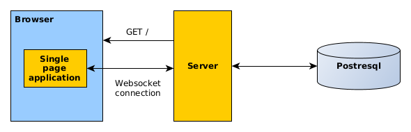

# Clojure(Script) fullstack CRUD application

Demo: [https://demo-patients-crud.herokuapp.com/](https://demo-patients-crud.herokuapp.com/)

# General app overview



# Technologies stack

Dependency management: deps.edn

Front:

* re-frame
* easy-ui
* Build: shadow-cljs
  
Back:

* http-kit
* compojure
* hiccup
* Pack jar: depstar
* DB:
    * postgresql
    * honeysql
	
Validation: schema
  
Communicate:

* websockets
* edn format
  
Testing:

* Back: module tests
* Acceptance test with:
    * etaoin (my fork)
    * selenium standalone grid (chrome, firefox)

# Environment vars

* `DATABASE_URL` - connection to DB
* `PORT` - server port listen
* `WS_URL` - URL to connection app with server

# Source code directory structure

```
src/
├── backend
│   ├── context.clj
│   ├── core.clj
│   ├── db.clj
│   ├── pages.clj
│   ├── patients_events.clj
│   ├── rop.clj
│   ├── utils.clj
│   ├── ws.clj
│   └── ws_events.clj
├── common
│   ├── patients.cljc
│   └── ui_anchors
│       ├── core.cljc
│       └── patients
│           ├── core.cljc
│           ├── datagrid.cljc
│           ├── dialog_create.cljc
│           ├── dialog_delete.cljc
│           ├── dialog_update.cljc
│           └── search_panel.cljc
└── frontend
    ├── comm.cljs
    ├── core.cljs
    ├── db.cljs
    ├── patients
    │   ├── datagrid.cljs
    │   ├── dialog_create.cljs
    │   ├── dialog_delete.cljs
    │   ├── dialog_update.cljs
    │   ├── models.cljs
    │   └── search_panel.cljs
    ├── patients.cljs
    ├── rf_nru_nwd.cljs
    └── utils.cljs
```

# Test directory structure

```
test/
├── acceptance
│   ├── context.clj
│   ├── core.clj
│   ├── easy_ui
│   │   ├── core.clj
│   │   ├── datagrid.clj
│   │   ├── form.clj
│   │   ├── layout_panel.clj
│   │   └── link_button.clj
│   ├── patients
│   │   ├── 00_default_view_test.clj
│   │   ├── core.clj
│   │   ├── create_test.clj
│   │   ├── delete_test.clj
│   │   ├── filter_test.clj
│   │   ├── read_test.clj
│   │   ├── screenshots
│   │   │   └── default-view.png
│   │   ├── search_test.clj
│   │   ├── sorting_test.clj
│   │   └── update_test.clj
│   └── utils.clj
├── backend
│   ├── patients_events_test.clj
│   └── ws_test.clj
└── generators
    └── patient.clj
```

# Deploy workflow


# Steps for install app in Kubernetes cluster from zero


In the current directory run commands:

1. `kubectl create namespace patients-crud-app`
2. `helm dependency build k8s/chart`

*Note: WS_URL used frontend app for communicate with backend.*

3. `helm install app k8s/chart --namespace patients-crud-app --set main.config.WS_URL='ws://<you domain and port>/ws'`

Migrate database schema:

4. `./migrate-db-schema-to-cluster.sh`

Check health of app:

5. `http://<you domain and port>/health`
6. Go application: `http://<you domain and port>`
