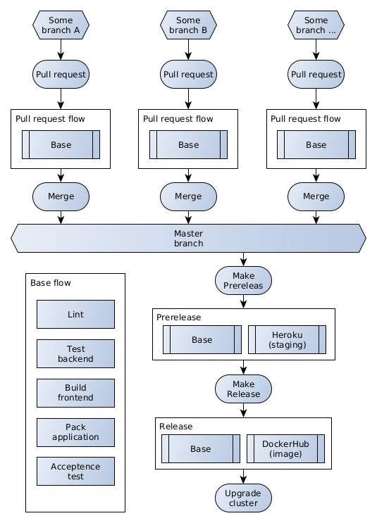
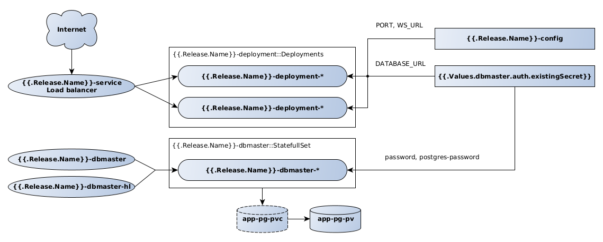

# HS patients CRUD application

# Deploy workflow

# Steps for install app in Kubernetes cluster from zero

In the current directory run commands:

1. `kubectl create namespace patients-crud-app`
2. `helm dependency build k8s/chart`

*Note: WS_URL used frontend app for communicate with backend.*

3. `helm install app k8s/chart --namespace patients-crud-app --set main.config.WS_URL='ws://<you domain and port>/ws'`

Migrate database schema:

4. `./migrate-db-schema-to-cluster.sh`

Check health of app:

5. `http://<you domain and port>/health`
6. Go application: `http://<you domain and port>`
